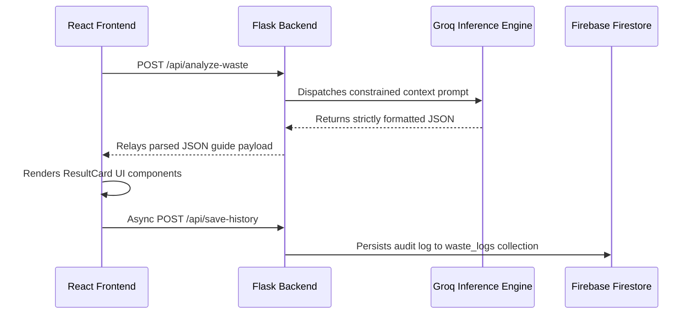
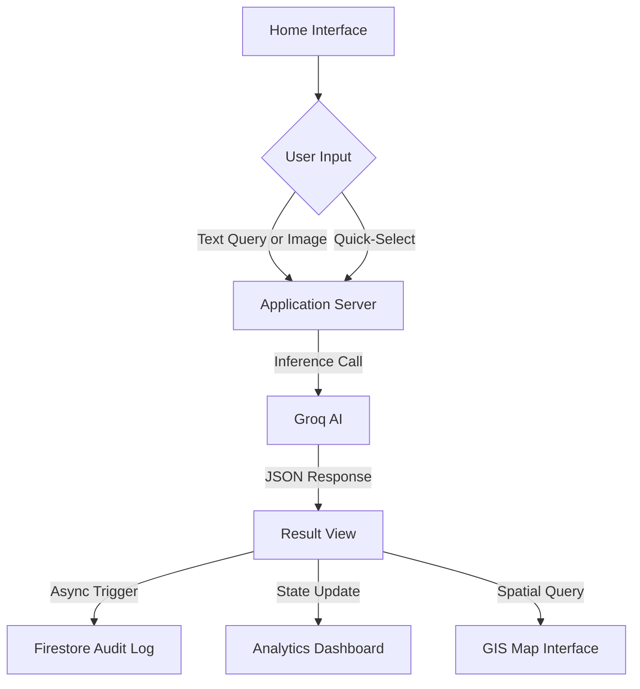

# System Architecture & Technical Specifications

This document outlines the high-level architecture, data flow, and component relationships for the EcoSprout AI platform. The system is designed using a decoupled client-server model, ensuring modularity, scalability, and robust telemetry tracking.

## Core Request Lifecycle: Waste Classification



## Component Architecture

| Subsystem | Technology Stack | Primary Responsibility |
|---|---|---|
| **Presentation Layer** | React.js (Vite), Tailwind CSS | Renders interactive interfaces (Scanner, GIS Map, Audit History, Analytics Dashboard). |
| **Identity Service** | Firebase Authentication | Manages user lifecycles and secure session provisioning via Email/Password authentication. Includes a fail-safe in-memory mode. |
| **Application Server** | Python (Flask), Modular Blueprints | Orchestrates RESTful API endpoints, handles business logic, and mediates external service integrations. |
| **Inference Engine** | Groq API (`llama-3.3-70b-versatile`) | Executes low-latency natural language processing to categorize waste and generate structured lifecycle guidance. Configured for determinism (temperature: 0.3). |
| **Data Persistence** | Firebase Firestore (NoSQL) | Provides durable storage for user profiles and longitudinal scan history telemetry. |
| **GIS Rendering** | Leaflet.js, OpenStreetMap | Renders interactive geographic data without proprietary licensing overhead. |
| **Data Visualization** | Chart.js, react-chartjs-2 | Transforms aggregated classification telemetry into intuitive user-facing charts. |

## Application Server Modules

The Flask backend is logically separated into distinct, single-responsibility modules:

- `routes/waste.py` — Orchestrates the `POST /api/analyze-waste` endpoint. Constructs contextual LLM prompts, executes inference requests, sanitizes outputs (stripping markdown artifacts), and implements a robust fallback strategy if inference fails.
- `routes/history.py` — Manages the data layer for audit logging and analytics. Exposes `POST /api/save-history`, `GET /api/get-history`, and `GET /api/dashboard-data` for querying and aggregating Firestore records.
- `routes/centers.py` — Serves geospatial collection facility data via `GET /api/get-centers`. Implements filtering by waste category and spatial sorting by proximity (`distance_km`).
- `firebase_config.py` — Bootstraps the Firebase Admin SDK. Architected with an automatic failover to an in-memory datastore if explicit service account credentials are unavailable, ensuring seamless local development.
- `groq_client.py` — Encapsulates the HTTP transport logic for the Groq API and maintains the core inference prompt templates.

## Standardized Inference Schema

The LLM is rigorously constrained to return payloads adhering strictly to the following JSON schema:

```json
{
  "item": "string",
  "category": "Organic Waste | Plastic Waste | Paper Waste | Glass Waste | Metal Waste | E-waste | Hazardous Waste | General Waste",
  "category_icon": "emoji",
  "is_recyclable": true,
  "is_hazardous": false,
  "is_reusable": false,
  "disposal_instructions": "2-3 highly legible, jargon-free sentences",
  "recycling_steps": ["step 1", "step 2", "step 3", "step 4"],
  "hazard_warning": "string or null",
  "eco_suggestions": ["tip 1", "tip 2", "tip 3"],
  "accepted_at": ["facility type 1", "facility type 2", "facility type 3"]
}
```

## User Experience Flow



## Local Development Topology

For local provisioning, the services bind to the following default network ports:

- **Application Server (Flask):** `http://localhost:5000`
- **Presentation Tier (Vite):** `http://localhost:5173`
